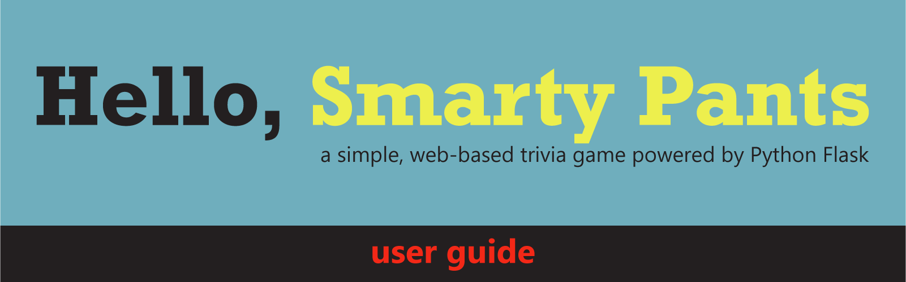
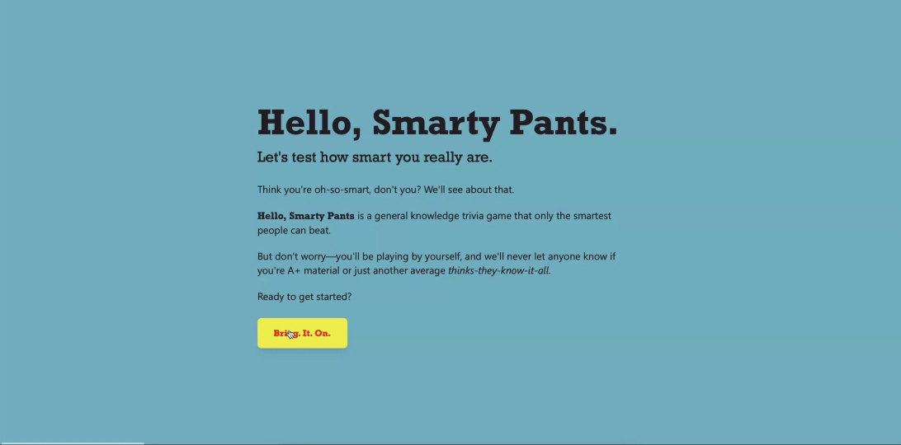
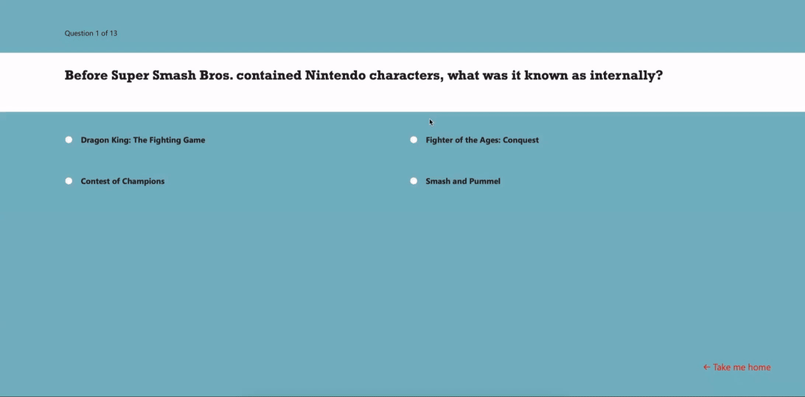
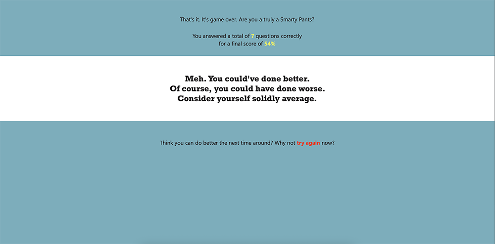

## **Overview**
**Hello, Smarty Pants** is a single-player trivia game web app powered by Python Flask. It uses the Open Trivia Database API to supply questions and associated answers. 

From the player perspective, it features a simple flow: start, play, see results.  You can test play the deployed prototype at [https://joellenroberts.pythonanywhere.com](https://joellenroberts.pythonanywhere.com) 

This app was originally built as a student project for Iowa State University’s HCI 5840 course in summer 2025.

## **Project Files**

**Hello, Smarty Pants** includes this these primary files:  

```
├── app.py                          # main app (created with Python 3.13.0)
├── requirements.txt                # required Python libraries
├── templates/                      
│   ├── home.html                   # app home
│   ├── start.html                  # start page
│   ├── question.html               # primary game play page
│   └── results.html                # end results summary page
├── static/
│   └── css/
│       └── style.css               # custom styling (otherwise Tailwind 4.1)
├── _docs/                          # reference docs
│   └── dev-guide.md                # developer's guide
├── _img/                           # reference images (not required to run app)
│   ├── Hello-Smarty-Pants-User-Guide.png   
│   ├── Hello-Smarty-Pants-Start-Game.png 
│   ├── Hello-Smarty-Pants-Play-Game.png
│   └── Hello-Smarty-Pants-Results.png
├── LICENSE                         # MIT license
└── README.md                       # user's guide
```

## **How to Run**

### ***Running on local machine***

To run the app on a local machine, follow these steps:

1\. Download the program files.

2\. Install these required third part libraries.  

```
pip install -r requirements.txt
```

If `pip` doesn’t work, try `pip3`.

All other modules used are part of the Python standard library.

3\. Run the main program file.  
```
python trivia_game.py
```

If `python` doesn’t work, try `python3`.

4\. Open a browser and navigate to `http://127.0.0.1:5000`. Once open, use the yellow CTA button to start.

### ***Deploying on a web server***

Please check your web host’s documentation for specific deployment instructions, including whether you need to install the latest Flask and Requests libraries separately. 

You must load `app.py` plus the associated `templates/` and `static/css/style.css` for the app to run.

### ***Style considerations: Tailwind***

Beyond the custom colors, fonts, and JavaScript effects found in `style.css`, **Hello, Smarty Pants** uses [Tailwind 4.1](https://tailwindcss.com) utilities for styling on each html template.

### ***Style considerations: Fonts***

The two primary fonts used within the app are Rockwell and Segoe UI. The latter is a standard font that comes with Windows and Microsoft Office. Both [Rockwell](https://fonts.adobe.com/fonts/rockwell) and [Segoe UI](https://fonts.adobe.com/fonts/segoe-ui) are also available as web fonts through Adobe Fonts and MyFonts. 

When installing the app, you will need to replace the current TypeKit placeholder `@import` link at the top of the `style.css` file and in the head section of each of the HTML templates. Otherwise, the specified fallback fonts will be loaded. 

## **Game Play Basics**

### ***User Flow Step 1: Start Game***

The potential player visits the app homepage and selects the button to start the game, which launches the countdown clock.



### ***User Flow Step 2: Play Game***

Now the game play officially begins. Player sees the first question and four answer choices. The player selects their answer by radio button—no second submit button action required. Easy? Peasy.

The answer is processed as soon as it’s selected. If the player guessed right, they get a “correct” user feedback message via pop-up overlay. If the guess is wrong, the player gets an “incorrect” feedback message. The score is updated and the next question loads automatically.



### ***User Flow Step 3: View Results***

Once the player answers all 13 questions, they sees a final results page with their score and one of four use feedback messages based on the percentage of questions they answered correctly. From here, they can choose to return to the beginning and start a new game.


